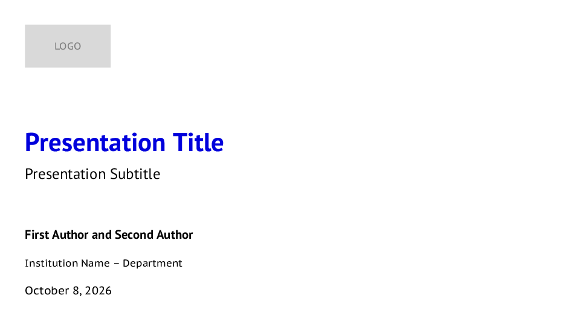
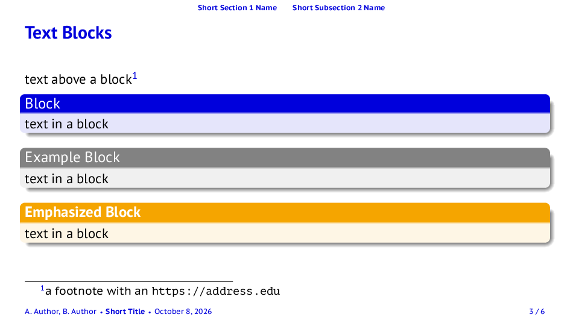

# slides-latex

A Beamer slide template based on the `mubeamer` theme (Masaryk University, LPPL 1.3), built with Docker so no local TeX installation is needed.

## Preview

| Title slide | Content slide |
| --- | --- |
|  |  |

## Usage

```sh
cd slides
make build      # builds the Docker image and compiles main.tex to main.pdf
make clean      # removes auxiliary files
make distclean  # also removes the PDF
```

To compile a different file, pass `DOC` without the extension: `make build DOC=talk`.

## Customizing

Everything you need to change is in `slides/main.tex`:

- **Metadata**: `\title`, `\subtitle`, `\author`, `\institute` and `\date`.
- **Logo**: redefine `\titlelogo`, which defaults to a gray placeholder box, e.g.
  `\newcommand\titlelogo{\includegraphics[height=1.2cm]{path/to/logo}}`.
- **Language**: change the `babel` option; the bibliography heading follows it.
- **References**: add entries to `slides/refs.bib`.

The frames in `main.tex` are examples of lists, blocks, tables and citations; replace them with your content.
